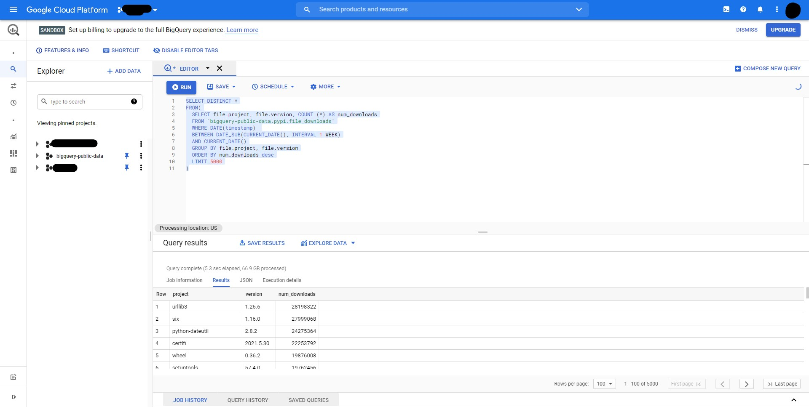

# Introduction

Python script to download wide variety of packages.
(Docker images, NPM, PyPi)

## Quickstart

First run the following commands to bootstrap your environment with `pip`:

    git clone https://github.com/sagico/baldar.git
    cd baldar

    python -m venv .venv
    * On Windows, run:
        .venv\bin\activate
    * On Unix or MacOS, run:
        source .venv/bin/activate

    pip install -r requirements.txt

Then create .env file (or rename and modify .env.example) in project root and set environment variables for application:

    echo "DB_CONNECTION = 'DRIVER={ODBC Driver 17 for SQL Server};SERVER=$SQL_SERVER;PORT=1433;DATABASE=$DATABASE;UID=$DB_USERNAME;PWD=$DB_PASSWORD'" >> .env
    echo "DOWNLOAD_PATH = '$PWD\path'" >> .env # Absolute path of download directory

### Set the download list

1.  Login google bigquery service at https://console.cloud.google.com/bigquery
2.  Run the next query over the public pypi stats project (bigquery-public-data.pypi.file_downloads):

        SELECT DISTINCT *
        FROM(
            SELECT file.project, COUNT (*) AS num_downloads
            FROM `bigquery-public-data.pypi.file_downloads`
            WHERE DATE(timestamp)
            BETWEEN DATE_SUB(CURRENT_DATE(), INTERVAL 1 WEEK)
            AND CURRENT_DATE()
            GROUP BY file.project
            ORDER BY num_downloads desc
            LIMIT 5000
        )

    
    This query will generate a csv with the 5000 most installed pypi packages formatted like this:

            project |  version  | num_downloads
                    |           |

    you'll need to download the csv and paste is absolute path in the ./main.py file

    Run and wait execution to finish 😊
